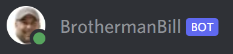

<div align="center">
	
	<p>Music and meme bot for Discord<p>
</div>


---

## 🤔About
Brotherman Bill (aka BrothermanBill) came from the need to fill Discord rooms with a little somethin' somethin'. Turns out, Discord bots aren't too bad to write yourself and BrothermanBill was born.  

✨ Read all about this in my post: [Writing a .NET Music Discord Bot for a Raspberry Pi Zero 2 W: Brotherman Bill](https://www.nikouusitalo.com/blog/writing-a-net-music-discord-bot-for-a-raspberry-pi-zero-2-w-brotherman-bill/) ✨

## 📝Features
- 🎧Audio
	- Youtube
	- Soundcloud
	- Vimeo
	- Twitch
- 🔀Playlist 
	- The usual player controls (play, pause, seek, stop, etc)
	- Queue up songs
	- Play a song immediately (then resume where the previous song left off)
	- Move current song to the back of the queue
	- Show currently playing
	- Show the queue
	- Clear the queue
- 😀Memes
	- Query [MyInstants](https://www.myinstants.com/search/?name=Meme) for meme soundbytes 
	- Fire off a random meme soundbyte
- 🧰Admin
	- Uptime
	- Get ping between bot an Discord server
	- !Kkona

## Setup

### .NET
Requires [.NET 6 or higher](https://dotnet.microsoft.com/en-us/download).

### Build
```
dotnet build
```

### Viewing the log on a Raspberry Pi
```
sudo journalctl -fu brothermanbill.service 
```

### Running manually
```
dotnet BrothermanBill.dll
```

## 🧱Dependencies
- [Victoria](https://github.com/Yucked/Victoria/)
- [Lavalink](https://github.com/freyacodes/Lavalink)

## 🎙️Namesake
[The classic TerribleTim song, *Brotherman Bill*](https://www.youtube.com/watch?v=qkUVToIfrKg)


*Yes that is the KKona emote, not Brotherman Bill*